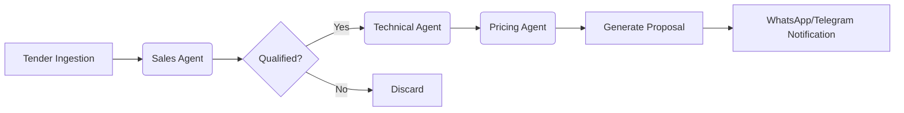

# 🚀 Cable RFP Automation Agent Swarm


**An intelligent, multi-agent system designed to automate the end-to-end Request for Proposal (RFP) process for enterprise cable manufacturing.**

---

## 🧠 System Architecture

This project utilizes a **Micro-Agentic Architecture** where specialized AI agents collaborate to analyze, quote, and respond to complex tender documents.

### 🤖 The Agent Swarm
1.  **Sales Agent (The Scout)** 🕵️‍♂️
    *   **Role:** Discover and qualify tenders.
    *   **Capabilities:** Scrapes global portals, extracts metadata, filters by win probability.
2.  **Technical Agent (The Engineer)** 🛠️
    *   **Role:** Analyze technical specs and ensure compliance.
    *   **Capabilities:** OCR scanning, PDF parsing, vector database matching with OEM product catalog.
3.  **Pricing Agent (The Strategist)** 💰
    *   **Role:** Calculate costs and determine profit margins.
    *   **Capabilities:** Dynamic raw material pricing (Copper/Aluminum), competitor analysis, overhead calculation.

---

## ⚡ Workflow



## 🛠️ Technology Stack

*   **Frontend:** React, Vite, TailwindCSS, Anime.js (Futuristic UI)
*   **Backend:** Python 3.9+, FastAPI
*   **AI/ML:** OpenAI GPT-4, PyTorch, PaddleOCR, Sentence-Transformers
*   **Database:** Qdrant (Vector DB), PostgreSQL
*   **Infrastructure:** Docker, Vercel (Frontend)

## 🚀 Getting Started

1.  **Clone the Repository**
    ```bash
    git clone https://github.com/Levi710/-cable-rfp-automation.git
    ```

2.  **Install Backend Dependencies**
    ```bash
    pip install -r requirements-backend.txt
    ```

3.  **Launch the Pipeline**
    ```bash
    python run_pipeline_new.py
    ```

4.  **Start the Dashboard**
    ```bash
    cd client
    npm install
    npm run dev
    ```

---

*Generated by Antigravity Agents*
