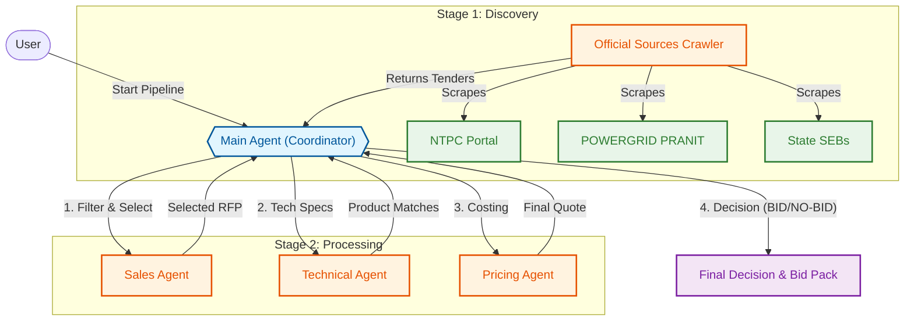

# Cable RFP Automation (Agentic AI System)

An autonomous multi-agent system designed to discover, analyze, and bid on government cable tenders. The system uses a **Hub-and-Spoke Agentic Architecture** to automate the end-to-end RFP process, from discovery to final bid generation.


---

## System Architecture

The system is built on a **Main Agent** architecture that coordinates specialized sub-agents.



---

## Agents & Capabilities

### 1. Main Agent (The Brain)
- **Role:** Orchestrator & Decision Maker
- **Function:** Coordinates data flow between agents, consolidates results, and calculates **Win Probability**.
- **Logic:**
  - `Win Probability > 50%` → **BID**
  - `Win Probability < 50%` → **NO-BID**

### 2. Sales Agent
- **Role:** Gatekeeper
- **Function:** Filters tenders based on:
  - **Deadlines:** Ensures tender is active (next 3-60 days).
  - **Relevance:** Checks for cable-specific keywords (XLPE, Power Cable, etc.).
- **Output:** Selects the most promising RFP for processing.

### 3. Technical Agent (Enhanced)
- **Role:** Engineer
- **Function:** 
  - Parses complex technical specifications from tender documents.
  - Matches requirements against an **OEM Product Catalog**.
  - Handles **Gap Analysis** (e.g., matching 11kV requirements to 11kV products).
  - Generates "New SKU Requests" if no suitable product exists.

### 4. Pricing Agent
- **Role:** Commercial Lead
- **Function:** 
  - Calculates **Material Costs** (Cable lengths * Unit rates).
  - Estimates **Service Costs** (Transport, Installation, Testing).
  - Adds **Margins & Taxes** (GST, Contingency).
  - Generates the final **Bill of Quantities (BOQ)**.

---

## Crawler System

The system includes robust crawlers for major Indian government e-procurement portals.

| Source | Feature | URL | resilience |
|--------|---------|-----|------------|
| **NTPC** | eProcurement | `eprocurentpc.nic.in` | Proxy Supported |
| **POWERGRID** | PRANIT Portal | `eprocure.powergrid.in` | Proxy Supported |
| **State SEBs** | Maharashtra, etc. | `mahadiscom.in` | Auto-Retry |

*   **Status Logging:** Tracks successful/failed scrapes in `output/crawler_status.json`.
*   **Proxy Support:** Configurable via `.env` for accessing geo-restricted portals.

---

## How to Run

### Prerequisites
- Python 3.11+
- Git

### 1. Clone the Repository
```bash
git clone https://github.com/Luciferai04/-cable-rfp-automation.git
cd -cable-rfp-automation
```

### 2. Setup Environment
Rename the template file and configure your settings:
```bash
cp .env.example .env
```
Edit `.env` to add your keys (optional) and Proxy settings if needed.

### 3. Install Dependencies
```bash
python3 -m venv venv
source venv/bin/activate
pip install -r requirements.txt
```

### 4. Run the Pipeline
Execute the main pipeline script:
```bash
python run_pipeline_new.py
```

### Outputs
Results are generated in the `output/` directory:
- `pipeline_results_new.json`: Complete JSON dump of the process.
- `crawler_status.json`: Health check of all crawlers.
- `new_sku_requests/`: Markdown files for any custom manufacturing requests.

---

## Decision Logic

The **BID / NO-BID** decision is based on a weighted probability algorithm:

1.  **Base Score:** 50%
2.  **Product Match:** 
    *   Match > 70%: **+5%** (Qualifies for BID)
    *   Match < 70%: **-5%** (Rejects as NO-BID)
3.  **Price Competitiveness** (if estimated value known):
    *   Quote within range: **+20%**
4.  **Urgency:**
    *   Urgent (<30 days): **+10%**

---

## Security
- **.gitignore:** Configured to exclude all sensitive data and outputs.
- **Environment Variables:** All secrets managed via `.env`.
- **Crawler resilience:** Handles SSL errors and proxies securely.
