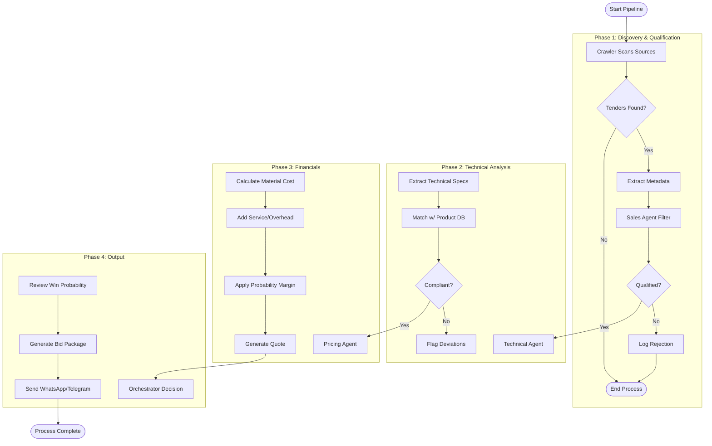

# Presentation Assets

## 1. System Architecture Diagram

This diagram represents the high-level architecture of the Cable RFP Automation System, utilizing a Micro-Agentic pattern.

```mermaid
graph TB
    subgraph "Frontend Layer (React)"
        A[Client Browser]
        B[Dashboard UI]
        C[Agent Visualizer]
    end

    subgraph "Backend Layer (Python/FastAPI)"
        D[API Gateway / Orchestrator]
        E[Notification Service]
        
        subgraph "Agent Swarm"
            F[Sales Agent<br/>(Qualification)]
            G[Technical Agent<br/>(Spec Matching)]
            H[Pricing Agent<br/>(Cost Calculation)]
        end
        
        I[Generative AI Engine<br/>(OpenAI GPT-4)]
        J[Data Ingestion<br/>(Crawlers)]
    end

    subgraph "Data Layer"
        K[(Vector DB<br/>Qdrant)]
        L[(Relational DB<br/>SQL)]
        M[Document Storage]
    end

    A --> B
    B --> D
    C --> D
    
    D --> F
    D --> G
    D --> H
    D --> E
    
    F <--> I
    G <--> I
    H <--> I
    
    J --> M
    M --> I
    
    F --> L
    G --> K
    H --> L
```

## 2. Process Flow Chart

This flowchart details the step-by-step execution pipeline from Tender Discovery to Final Bid Submission.



## 3. Wireframes

*Wireframes are attached as separate image assets.*
